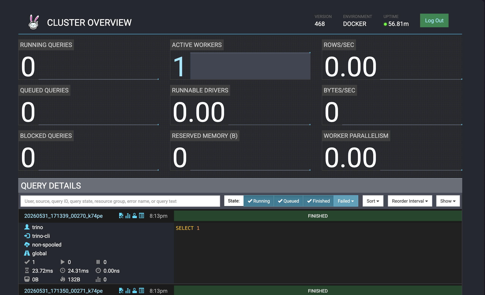
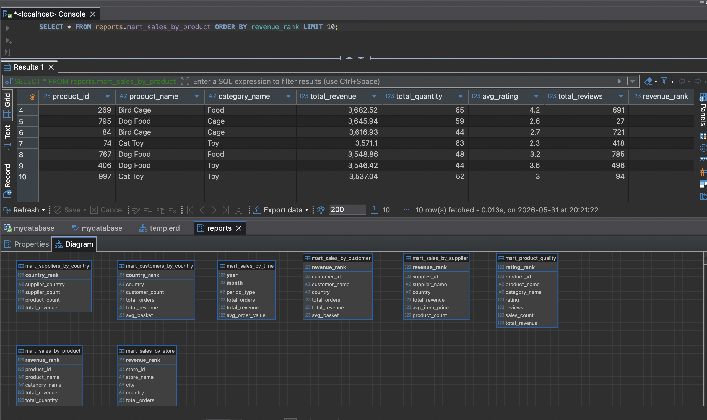

# BigDataTrino
Анализ больших данных - лабораторная работа №4 - ETL реализованный с помощью Trino

Одним из самых популярных фреймворков для анализа данных Big Data является Trino. Trino позволяет с помощью SQL анализировать большие объёмы данных.

Что необходимо сделать?

Необходимо реализовать ETL с помощью Trino, который трансформирует данные из источников ClickHouse (первые 5 файлов mock_data.csv) и PostgreSQL (следующие 5 файлов mock_data.csv) в модель данных снежинка/звезда в ClickHouse, а затем на основе модели данных снежинка/звезда создать ряд отчетов по данным в ClickHouse. Каждый отчет представляет собой отдельную таблицу в ClickHouse

Какие отчеты надо создать?
1. Витрина продаж по продуктам
Цель: Анализ выручки, количества продаж и популярности продуктов.
 - Топ-10 самых продаваемых продуктов.
 - Общая выручка по категориям продуктов.
 - Средний рейтинг и количество отзывов для каждого продукта.
2. Витрина продаж по клиентам
Цель: Анализ покупательского поведения и сегментация клиентов.
 - Топ-10 клиентов с наибольшей общей суммой покупок.
 - Распределение клиентов по странам.
 - Средний чек для каждого клиента.
3. Витрина продаж по времени
Цель: Анализ сезонности и трендов продаж.
 - Месячные и годовые тренды продаж.
 - Сравнение выручки за разные периоды.
 - Средний размер заказа по месяцам.
4. Витрина продаж по магазинам
Цель: Анализ эффективности магазинов.
 - Топ-5 магазинов с наибольшей выручкой.
 - Распределение продаж по городам и странам.
 - Средний чек для каждого магазина.
5. Витрина продаж по поставщикам
Цель: Анализ эффективности поставщиков.
 - Топ-5 поставщиков с наибольшей выручкой.
 - Средняя цена товаров от каждого поставщика.
 - Распределение продаж по странам поставщиков.
6. Витрина качества продукции
Цель: Анализ отзывов и рейтингов товаров.
 - Продукты с наивысшим и наименьшим рейтингом.
 - Корреляция между рейтингом и объемом продаж.
 - Продукты с наибольшим количеством отзывов.


Алгоритм:
1. Клонируете к себе этот репозиторий.
2. Устанавливаете себе инструмент для работы с запросами SQL (рекомендую DBeaver).
3. Устанавливаете базу данных PostgreSQL (рекомендую установку через docker).
4. Устанавливаете базу данных ClickHouse (рекомендую установку через docker).
5. Устанавливаете Trino (рекомендую установку через Docker).
6. Скачиваете файлы с исходными данными mock_data( * ).csv, где ( * ) номера файлов. Всего 10 файлов, каждый по 1000 строк.
7. Импортируете данные в БД PostgreSQL (например, через механизм импорта csv в DBeaver). Всего в таблице mock_data должно находиться 5000 строк из 5 файлов.
8. Импортируете данные в БД ClickHouse (например, через механизм импорта csv в ClickHouse). Всего в таблице mock_data должно находиться 5000 строк из других 5 файлов.
9. Анализируете исходные данные с помощью запросов.
10. Выявляете сущности фактов и измерений.
11. Реализуете скрипты Trino, которые по аналогии с первой лабораторной работой перекладывают исходные данные из PostgreSQL и ClickHouse в модель снежинку/звезда в ClickHouse. (Убедитесь в коннективности Trino, PostgreSQL, ClickHouse настройте сеть между Trino, PostgreSQL, ClickHouse если используете Docker).
12. Устанавливаете ClickHouse (рекомендую установку через Docker. Убедитесь в коннективности Spark и Clickhouse, настройте сеть между Spark и ClickHouse).
13. Реализуете расчеты на Trino, которые создают все 6 перечисленных выше отчетов в виде 6 отдельных таблиц в ClickHouse.
14. Проверяете отчеты в каждой базе данных средствами языка самой БД (ClickHouse - SQL (DBeaver)).
15. Отправляете работу на проверку лаборантам.

Что должно быть результатом работы?

1. Репозиторий, в котором есть исходные данные mock_data().csv, где () номера файлов. Всего 10 файлов, каждый по 1000 строк.
2. Файл docker-compose.yml с установкой PostgreSQL, Trino, ClickHouse с заполненными данными в PostgreSQL, ClickHouse из файлов mock_data(*).csv.
3. Инструкция, как запускать Trino-скрипты для проверки лабораторной работы.
4. Код Trino трансформации данных из исходной модели в снежинку/звезду в ClickHouse.
5. Код Trino трансформации данных из снежинки/звезды в отчеты в ClickHouse.

---

## Что я сделал

Поднял весь стек через `docker compose`: PostgreSQL, ClickHouse и Trino (образ `trino:468`). Данные намеренно разнесены по двум источникам — первые 5 CSV-файлов (`MOCK_DATA.csv`, `(1)`–`(4)`) загружаются в staging-таблицу `mock_data` в ClickHouse, следующие 5 (`(5)`–`(9)`) — в `mock_data` в PostgreSQL, по 5000 строк в каждой. Trino через два каталога (`postgresql` и `clickhouse`) видит оба источника одновременно.

Весь ETL — это чистый Trino SQL, без отдельного приложения. `trino/scripts/01_star_schema.sql` объединяет обе staging-таблицы через `UNION ALL` (federated query поверх двух разных СУБД) и раскладывает результат в модель звезда в схему `clickhouse.star`. `trino/scripts/02_reports.sql` поверх звезды строит 8 витрин-отчётов в схеме `clickhouse.reports`.

Главная сложность по сравнению с Spark-лабой: ClickHouse-коннектор Trino создаёт **все** колонки как `Nullable`, из-за чего ключи `ORDER BY` движка `MergeTree` оказываются nullable и `CREATE TABLE` падает с ошибкой `Sorting key contains nullable columns`. Лечится серверным конфигом `clickhouse/config/allow_nullable_key.xml`, смонтированным в `/etc/clickhouse-server/config.d/` (именно `config.d`, а не `users.d` — это настройка движка `merge_tree`, а не профиля, иначе сервер не стартует). Таблицы создаются через свойства Trino `WITH (engine='MergeTree', order_by=ARRAY[...])`.

---

## Как запустить

### Одной командой

```bash
bash run.sh
```

Скрипт поднимает все контейнеры, дожидается их готовности, загружает CSV в ClickHouse и PostgreSQL, после чего прогоняет оба Trino-скрипта (`01_star_schema.sql` → `02_reports.sql`) и выводит сводку по таблицам.

### Вручную по шагам

```bash
# 1. Поднять инфраструктуру (PostgreSQL + ClickHouse + Trino)
docker compose up -d

# 2. Проверить, что данные загрузились в оба источника (по 5000 строк)
docker compose exec postgres psql -U postgres -d mydatabase \
  -c "SELECT count(*) FROM mock_data;"
docker compose exec clickhouse clickhouse-client -q "SELECT count() FROM mock_data"

# 3. Построить звезду в ClickHouse из обоих источников
docker compose exec -T trino trino -f /scripts/01_star_schema.sql

# 4. Построить 8 витрин-отчётов
docker compose exec -T trino trino -f /scripts/02_reports.sql
```

Trino Web UI: **http://localhost:8080**

### Проверить результат

```bash
docker compose exec clickhouse clickhouse-client -q "SELECT count() FROM star.fact_sales"
# ожидается 10000
```

Подключение в DBeaver (ClickHouse): host `localhost:8123`, user `clickhouse`, password `password`. Витрины лежат в схеме `reports`:

```sql
SELECT * FROM reports.mart_sales_by_product     ORDER BY revenue_rank LIMIT 10;
SELECT * FROM reports.mart_sales_by_customer    ORDER BY revenue_rank LIMIT 10;
SELECT * FROM reports.mart_customers_by_country ORDER BY country_rank;
SELECT * FROM reports.mart_sales_by_time        ORDER BY year, month;
SELECT * FROM reports.mart_sales_by_store       ORDER BY revenue_rank LIMIT 5;
SELECT * FROM reports.mart_sales_by_supplier    ORDER BY revenue_rank LIMIT 5;
SELECT * FROM reports.mart_suppliers_by_country ORDER BY country_rank;
SELECT * FROM reports.mart_product_quality      ORDER BY rating_rank  LIMIT 10;
```

### Структура звезды (`clickhouse.star`)

Ключи — суррогатные (генерируются через `row_number()`), кроме `customer_id`/`seller_id`/`product_id`, где взяты натуральные ключи из источника.

| Таблица | Ключ сортировки (`order_by`) | Содержание |
|---|---|---|
| `dim_customer` | `customer_id` | Клиенты (ссылка на `dim_pet_type`) |
| `dim_seller` | `seller_id` | Продавцы |
| `dim_product` | `product_id` | Товары (ссылки на категорию и поставщика) |
| `dim_product_category` | `category_id` | Категории товаров |
| `dim_supplier` | `supplier_id` | Поставщики (дедуп по `name + city`) |
| `dim_pet_type` | `pet_type_id` | Типы питомцев |
| `dim_store` | `store_id` | Магазины (дедуп по `name + city`) |
| `dim_date` | `date_id` | Даты продаж (день/месяц/квартал/год) |
| `fact_sales` | `sale_id` | Факты продаж (10000 строк из двух источников) |

### Состав витрин (`clickhouse.reports`)

| Таблица | Содержание |
|---|---|
| `mart_sales_by_product` | Выручка по товарам, топ-10, средний рейтинг |
| `mart_sales_by_customer` | Топ клиентов, средний чек |
| `mart_customers_by_country` | Распределение клиентов по странам |
| `mart_sales_by_time` | Месячные и годовые тренды (`month=0` — год целиком) |
| `mart_sales_by_store` | Топ-5 магазинов, города, страны |
| `mart_sales_by_supplier` | Топ-5 поставщиков, средняя цена |
| `mart_suppliers_by_country` | Распределение продаж по странам поставщиков |
| `mart_product_quality` | Рейтинг и отзывы товаров |

## Результаты




